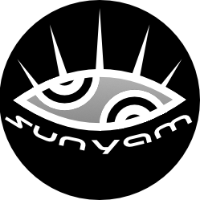

<a name="readme-top"></a>

[![Contributors][contributors-shield]][contributors-url]
[![Forks][forks-shield]][forks-url]
[![Stargazers][stars-shield]][stars-url]
[![Issues][issues-shield]][issues-url]
[![MIT License][license-shield]][license-url]
[![LinkedIn][linkedin-shield]][linkedin-url]


<!-- PROJECT LOGO -->
<br />
<div align="center">
  <a href="https://github.com/sunyam-lexicon-2024/aspnet-mvc">
    
  </a>

<h3 align="center">ASP.NET MVC</h3>

  <p align="center">
    ASP.NET MVC documentation
    <br />
    <a href="https://github.com/sunyam-lexicon-2024/aspnet-mvc"><strong>Explore the docs »</strong></a>
    <br />
    <br />
    <a href="https://github.com/sunyam-lexicon-2024/aspnet-mvc">View Demo</a>
    ·
    <a href="https://github.com/sunyam-lexicon-2024/aspnet-mvc/issues/new?labels=bug&template=bug-report---.md">Report Bug</a>
    ·
    <a href="https://github.com/sunyam-lexicon-2024/aspnet-mvc/issues/new?labels=enhancement&template=feature-request---.md">Request Feature</a>
  </p>
</div>


<!-- TABLE OF CONTENTS -->
<details>
  <summary>Table of Contents</summary>
  <ol>
    <li>
      <a href="#about-the-project">About The Project</a>
      <ul>
        <li><a href="#assignment-document">Assignment Document</a></li>
        <li><a href="#current-status">Currens Status</a></li>
        <li><a href="#built-with">Built With</a></li>
      </ul>
    </li>
    <li>
      <a href="#getting-started">Getting Started</a>
      <ul>
        <li><a href="#prerequisites">Prerequisites</a></li>
        <li><a href="#installation">Installation</a></li>
      </ul>
    </li>
    <li><a href="#usage">Usage</a></li>
    <li><a href="#roadmap">Roadmap</a></li>
    <li><a href="#contributing">Contributing</a></li>
    <li><a href="#license">License</a></li>
    <li><a href="#contact">Contact</a></li>
    <li><a href="#acknowledgments">Acknowledgments</a></li>
  </ol>
</details>


<!-- ABOUT THE PROJECT -->
## About The Project

![![ASP.NET MVC Screen Shot][product-screenshot]](.docs/images/screenshot.png)

An ASP.NET Core bases MVC application, created as part of studies carried out at [Lexicon AB](https://lexicon.se) 2024

<p align="right"><a href="#readme-top">🔝</a></p>


### Assignment Document

[Assignment 11 PDF](.docs/pdf/assignment-11.pdf)

<p align="right"><a href="#readme-top">🔝</a></p>


### Current Status

[](https://app.fossa.com/projects/custom%2B45338%2Fgithub.com%2FSunyam-Lexicon-2024%2Faspnet-mvc?ref=badge_shield&issueType=license)
[](https://github.com/Sunyam-Lexicon-2024/aspnet-mvc/actions/workflows/build.yml)

<p align="right"><a href="#readme-top">🔝</a></p>


### Built With

[![.NET][.NET]][.NET-url]
[![Podman][Podman]][Podman-url]

<p align="right"><a href="#readme-top">🔝</a></p>


<!-- GETTING STARTED -->
## Getting Started

The instructions below give an example on how to get the project running locally. 
<br>
Do note that differences do occur depending on your setup and local environment.
To get a local copy up and running follow these simple example steps.

### Prerequisites

This is an example of how to install required .NET SDK and runtime on Debian 12. For other platforms; refer to the [official documentation](https://learn.microsoft.com/en-us/dotnet/core/install/).
**Note that is only applies to running the application locally**.

##### Install Microsoft Package signing key
  ```sh
  wget https://packages.microsoft.com/config/debian/12/packages-microsoft-prod.deb -O packages-microsoft-prod.deb
  sudo dpkg -i packages-microsoft-prod.deb
  rm packages-microsoft-prod.deb
  ```
##### install .NET SDK
  ```sh
  sudo apt-get update && \
  sudo apt-get install -y dotnet-sdk-8.0
  ```
##### install .NET Runtime
  ```sh
  sudo apt-get update && \
  sudo apt-get install -y aspnetcore-runtime-8.0
  ```

### Installation

#### local environment

##### 1.1 Clone the repo
   ```sh
   git clone https://github.com/sunyam-lexicon-2024/aspnet-mvc.git
   cd aspnet-mvc
   ```
##### 1.2 Build the project
   ```sh
   dotnet build 
   ```
##### 1.3 Run the application
   ```sh
   dotnet ef database update --project MVC.Web
   dotnet run --project MVC.Web
   ```

#### Docker Compose

##### 2.1 Clone the repo
   ```sh
   git clone https://github.com/sunyam-lexicon-2024/aspnet-mvc.git
   cd aspnet-mvc
   ```
##### 2.2 Build the project
   ```sh
   docker-compose up -f development.docker-compose.yaml up -d
   ```
##### 2.3 Attach to containers
```sh
docker exec -it -w /workspace aspnet-mvc bash
```
##### 2.4
Continue from step [1.2](#12-build-the-project)

<p align="right"><a href="#readme-top">🔝</a></p>


<!-- USAGE EXAMPLES -->
## Usage

The MVC application handles CRUD operations for _Product_ entities via a simple user interface.
<br>
Consult the Swagger documentation on [https://localhost:3000/](https://localhost:3000/) for details about interacting with the API.
If the application is run locally, make sure to mirror the MSSQL setup provided with the [docker-compose](development.docker-compose.yaml) file.

<p align="right"><a href="#readme-top">🔝</a></p>


<!-- ROADMAP -->
## Roadmap

- [x] Models
- [x] Views
- [x] Controllers
- [x] SQLite Database Connection

<br>

See the [open issues](https://github.com/sunyam-lexicon-2024/aspnet-mvc/issues) for a full list of proposed features (and known issues).

<p align="right"><a href="#readme-top">🔝</a></p>


<!-- CONTRIBUTING -->
## Contributing

Contributions are what make the open source community such an amazing place to learn, inspire, and create. Any contributions you make are **greatly appreciated**.

If you have a suggestion that would make this better, please fork the repo and create a pull request. You can also simply open an issue with the tag "enhancement".
Don't forget to give the project a star! Thanks again!

#### 1. Fork the Project
```sh
gh repo fork sunyam-lexicon-2024/aspnet-mvc --clone
cd aspnet-mvc
```
#### 2. Create your Feature Branch 
```sh
git checkout -b feature/aNewCoolFeature
```
#### 3. Commit your Changes 
```sh
git commit -m 'Add a new cool feature'
```
#### 4. Push to the Branch 
```sh
git push origin feature/aNewCoolFeature
```
#### 5. Open a Pull Request
```sh
gh pr create 
```

<p align="right"><a href="#readme-top">🔝</a></p>


<!-- LICENSE -->
## License

Distributed under the MIT License. See [LICENCE.txt](LICENCE.txt) for more information.

<p align="right"><a href="#readme-top">🔝</a></p>


<!-- CONTACT -->
## Contact

Your Name - [@sunyam.bsky.social](https://bsky.app/profile/sunyam.bsky.social) - [visualarea.1@gmail.com](mailto:visualarea.1@gmail.com)

#### Project Link
[https://github.com/sunyam-lexicon-2024/aspnet-mvc](https://github.com/sunyam-lexicon-2024/aspnet-mvc)

<p align="right"><a href="#readme-top">🔝</a></p>

[contributors-shield]: https://img.shields.io/github/contributors/sunyam-lexicon-2024/aspnet-mvc.svg?style=for-the-badge
[contributors-url]: https://github.com/sunyam-lexicon-2024/aspnet-mvc/graphs/contributors
[forks-shield]: https://img.shields.io/github/forks/sunyam-lexicon-2024/aspnet-mvc?style=for-the-badge
[forks-url]: https://github.com/sunyam-lexicon-2024/aspnet-mvc/network/members
[stars-shield]: https://img.shields.io/github/stars/sunyam-lexicon-2024/aspnet-mvc.svg?style=for-the-badge
[stars-url]: https://github.com/sunyam-lexicon-2024/aspnet-mvc/stargazers
[issues-shield]: https://img.shields.io/github/issues/sunyam-lexicon-2024/aspnet-mvc.svg?style=for-the-badge
[issues-url]: https://github.com/sunyam-lexicon-2024/aspnet-mvc/issues
[license-shield]: https://img.shields.io/github/license/sunyam-lexicon-2024/aspnet-mvc.svg?style=for-the-badge
[license-url]: https://github.com/sunyam-lexicon-2024/aspnet-mvc/blob/main/LICENSE.txt
[linkedin-shield]: https://img.shields.io/badge/-LinkedIn-black.svg?style=for-the-badge&logo=linkedin&colorB=555
[linkedin-url]: https://linkedin.com/in/carl-sandberg-01070a2b6/
[product-screenshot]: .docs/images/screenshot.png
[.NET]: https://img.shields.io/badge/.NET-5C2D91?style=for-the-badge&logo=.net&logoColor=white
[.NET-url]: https://dotnet.microsoft.com/
[Podman]: https://img.shields.io/badge/podman-000000?style=for-the-badge&logo=podman&logoColor=white&logoSize=large&color=892CA0
[Podman-url]:https://podman.io